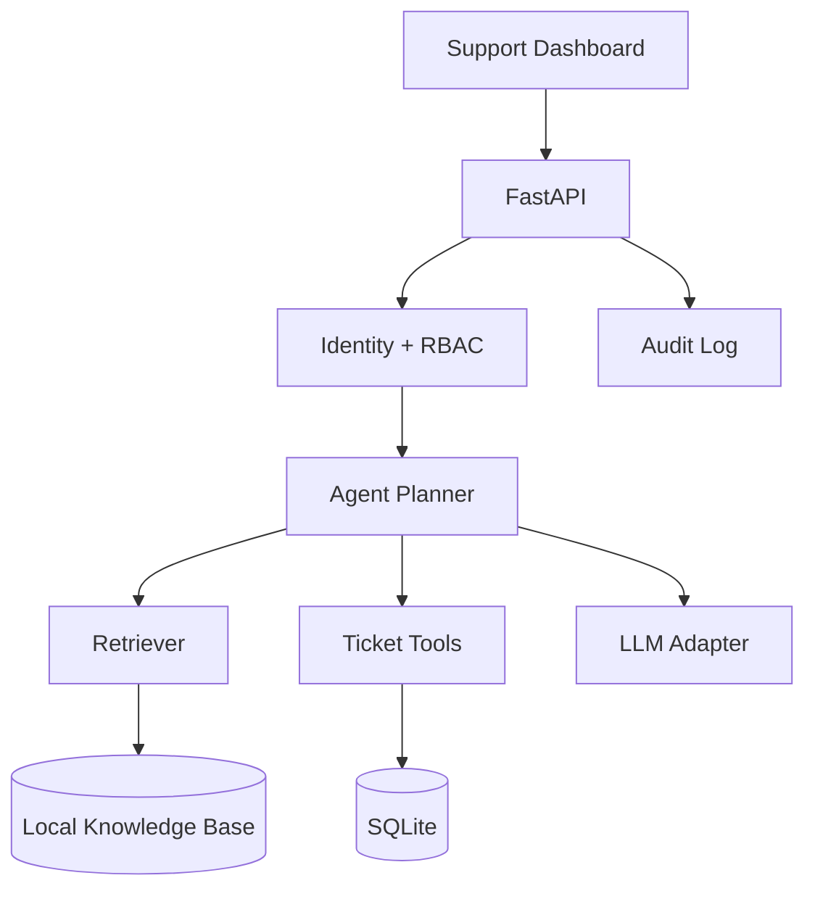

# Enterprise RAG Agent — Secure Support Copilot

A local-first enterprise support assistant that combines retrieval-augmented generation, controlled tools, RBAC, audit logging and a browser dashboard.

**Portfolio scope:** this is a demonstrator of enterprise AI engineering patterns; it is not presented as a production SaaS deployment.

## What the project demonstrates

- Retrieval over internal policy/product content
- LLM adapter with deterministic mock mode and optional local Ollama inference
- Tool-oriented agent workflow: knowledge search, ticket lookup and controlled ticket creation
- Role-aware permissions (`viewer`, `support`, `admin`)
- Retrieval boundary intended to reduce prompt-injection propagation
- Request IDs and audit records
- Health/metrics endpoints
- FastAPI + OpenAPI
- Responsive browser dashboard with execution/evidence visibility
- Automated tests

## Architecture



## Security model

1. User identity is represented by the request/UI user context.
2. Tool permissions are checked before sensitive actions.
3. Retrieved text is treated as **data**, not as trusted instructions.
4. Ticket creation is a controlled capability rather than arbitrary code execution.
5. Audit events provide a trace of important actions.

For a production deployment, extend this with an external identity provider, tenant isolation, encrypted storage, secret management, rate limiting, policy-as-code, centralized logs and stronger adversarial evaluation.

## Run locally

### Zero-cost mock mode

```bash
python -m venv .venv
# Windows: .venv\\Scripts\\activate
# Linux/macOS: source .venv/bin/activate
pip install -r requirements.txt
python -m app.ingest
set LLM_MODE=mock
# PowerShell: $env:LLM_MODE="mock"
# Linux/macOS: export LLM_MODE=mock
uvicorn app.main:app --reload
```

Open `http://127.0.0.1:8000` and API docs at `http://127.0.0.1:8000/docs`.

### Optional local model

Install Ollama and pull a model supported by your machine. Configure the model through the environment variables used by `app/llm.py`.

No AWS/GCP/Azure account is required.

## Demo flow

1. Select `viewer`, `support`, or `admin` in the dashboard.
2. Ask a policy/product question.
3. Inspect retrieved evidence.
4. Inspect the agent/tool trace.
5. Try a privileged ticket operation with an insufficient role and observe the policy boundary.
6. Review the resulting audit information.

## Example API checks

```bash
curl http://127.0.0.1:8000/health
curl http://127.0.0.1:8000/metrics
```

Use `/docs` for the exact request schemas exposed by the application.

## Evaluation / tests

```bash
python -m pytest -q
```

The tests focus on deterministic API behavior and permission boundaries. A production extension would add a labeled RAG evaluation set covering retrieval recall, groundedness, refusal behavior, tool authorization and latency.

## Design trade-offs

| Decision | Why |
|---|---|
| Local lightweight retrieval | Zero-cost, reproducible demo without a hosted vector DB |
| Ollama adapter | Local inference while keeping the model boundary replaceable |
| SQLite | Simple persistence and audit demonstration |
| Controlled tools | Safer than exposing arbitrary code execution |
| Mock mode | Deterministic tests and demos without model downloads |

## Resume bullets

- Built a **local-first enterprise RAG support agent** with FastAPI, role-based tool permissions, retrieval grounding, audit logging and a responsive operations dashboard.
- Implemented a **controlled agent/tool boundary** for knowledge search and ticket workflows, treating retrieved content as untrusted data and enforcing least-privilege actions.
- Added deterministic mock inference, automated tests, Docker support and OpenAPI documentation to make the AI workflow reproducible and portable.

## Interview questions to prepare

- Why RAG instead of putting all documents in the prompt?
- How would you prevent cross-tenant retrieval?
- What happens when retrieved text contains malicious instructions?
- How would you evaluate groundedness and retrieval quality?
- How would you replace local inference with a managed model endpoint?
- Which actions should require human approval?

## Screenshot checklist for GitHub

After running the UI, add 2–3 images under `docs/images/`:

- `dashboard.png` — main support dashboard
- `trace.png` — agent/tool execution trace
- `rbac.png` — permission boundary demonstration

Do not upload secrets, API keys or private customer data.
